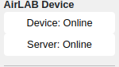

# AIRlab Storage Tools Device

When you need to get your files from here to the server. The Storage Tools Device will run on any platform that supports Docker.  

## Requirements

* [Docker Compose](https://docs.docker.com/compose/install/standalone/)

## Installation

* Install [Docker Compose](https://docs.docker.com/compose/install/standalone/) following the instructions for your operating system.  

* Clone this repo.

  ```bash
  cd /opt 
  git clone https://github.com/castacks/storage_tools_device
  cd stroage_tools_device
  ```

* Update the `config.env` to match your system.

  * Required
    * `DATA_DIR`. This is the top level data directory that all of the `watch` dirs share.  For example, if you `watch` directories are `/mnt/data/processor_1` and `/mnt/data/processor_2`, set the `DATA_DIR` to `/mnt/data`.  
  * Optional
    * `CONFIG_PORT`. The HTTP port to edit the configuration.  Navigate to http://YOUR_DEVICE_IP:CONFIG_PORT to edit the configurations and view online status. The default port is  8811.

## Build and run

This sets up the environment and configures the image to start on boot.

``` bash
cd /opt/storage_tools_device

# run in foreground 
docker compose --env-file config.env up --build --remove-orphans

# run in background
docker compose --env-file config.env up --build --remove-orphans -d
```

## Configure the Device

Navigate to http://YOUR_DEVICE_IP:CONFIG_PORT to edit the configurations and view online status. The default port is  8811.


### Online Indicators



**Device**: Is the dashboard connected to the device?  Online means yes. Offline means no.  If you see "Offline", check your network to see if the Device is connected.

**Server**: Is the device connected to a server?  Online means yes. Go to the Connection tab to see which server is connected.  Offline or Unknown means the Device is trying to connect to a server and has not completed the handshake.

### Device Configuration

You must update all *Required* fields.  

* **Project Name**:  Name of the project. If this is empty, the server will ask you to fill in the name.
* **Robot Name**: (Required) Name of this robot. This should be unique within the project.
* **API Key Token**: (Required) The API_KEY_TOKEN for this robot. Your admin can provide this to you. If you are running your own upload server, it is set in the Config->Keys page.
* **Watch**: (Required) The list of directories to be watched.  Any file with a matching suffix (see Include Suffix) will be uploaded. These all must be in the same subdirectory as `DATA_DIR` from the `config.env` file.
* **Servers**:  List of potential servers.  If this is empty, the Device will search for servers using ZeroConf.
* **Local Time Zone**: The time zone that the logs were recorded in.
* **Threads**: The number of threads used for uploading from this device to the server.
* **Include Suffix**: The list of included suffixes.  Any file in the Watch directory (see above) that matches one of these suffixes will be uploaded to the server.
* **Watch Interval**: How long to wait in seconds before attempting to connect to server again.

Press [Save] to commit the changes to the device.  

Press [Refresh] to refesh the page with the on device settings.

### Device Connection


The text field will show the name of the currently connected Server.  Presssing [Disconnect] will disconnect from the Server, and the Device will automatically try to connect to a new server.  Use this when you change one of the servers while connected.  

## Stop

``` bash
cd /opt/storage_tools_device
. env.sh
docker compose down
```

## Artifacts

The Storage Tools Device creates additional files to speed up processing.  These will always in the form of `{original_file_name}.md5` and `{original_file_name}.metadata`. These files will only be created in the `watch` directories as defined by the config yaml file.  These files can be safely removed. They will be regenerated when the system scans again.

## Troubleshooting

[Troubleshooting](docs/Troubleshooting.md)
[Known Bugs](docs/KnownBugs.md)
